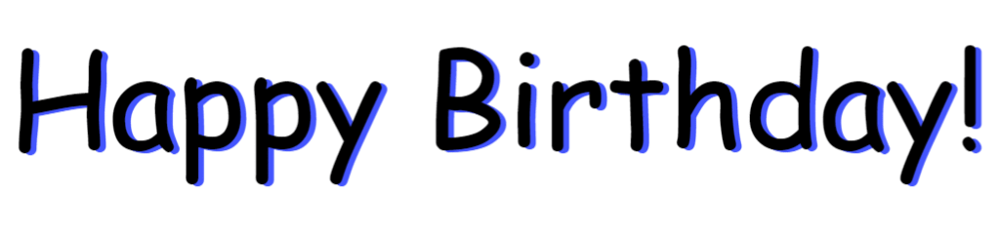
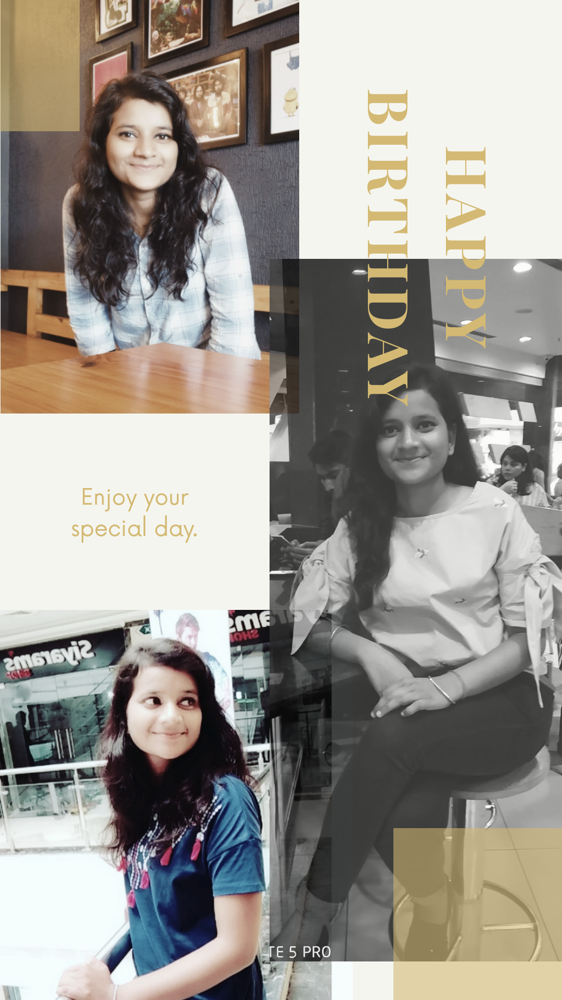
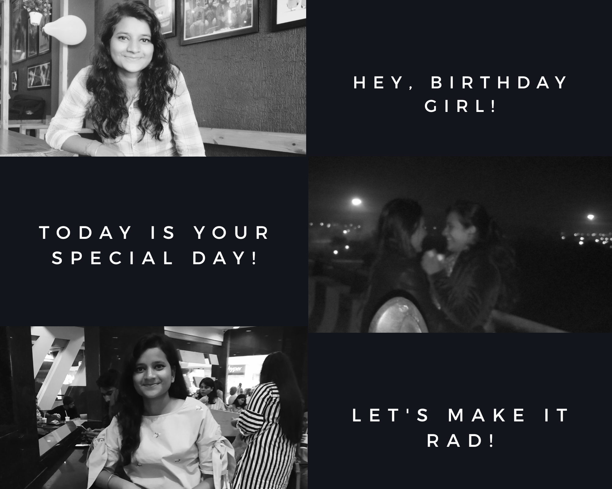

:octocat: [Link to Webpage!](https://limbo-09.github.io/birthday/)

# Table of Wanderlust 
* [Class VI-A](#class-vi-a)
* [1 January, 2016](#1-january-2016)
* [Purple Lady Bird](#purple-lady-bird)
* [A Glimpse of our Sisterhood!](#a-glimpse-of-our-sisterhood)

# Class VI-A
'''
Those summary day's, talkative class, Punishments , THE PANCHYAATI GROUP (your true friends i should say ) and the sitting arrangements .
I thank all these things that happened with you at that time and specially ma'am for giving you opportunity to be my seat mate .
From that day to now and always , i want you to be with me like we are today , sharing this bond ! Our sisterhood. 
'''
# Purple Lady Bird 
> The best thing about our bird was that it taught me "yeh ldki kbhi bhi bole haan haan niklo tyaar hoon" mt nikal bhain mt nikal yeh late kre gi :joy:.
You know sharing road , talking , discussing about all the worthless things . Remind me of "cycle waale bhaiyaa jo hawa daltee th "
It's like abhi toh yr hum school jaate th fir kaha chaale gaye ... The best part with you was The lady bird .
# 1 January, 2016
 This date is enough to give you flash back of all the scotty rides .
Or aaj bhi pair dard hotaa hai :sweat_smile:
# A Glimpse of our Sisterhood!
 Yr i try writing something about us words fall short. I don't reckon anybody can define friendship or sisterhood for me more than you .
I'm not that much good with words and expressing feeling to you . But i know tum smjh jaao gi . Sometimes it's amaze me how long back ago we didn't know each other being in same class and now see here we are .
It's 10 years bro ! Love you
Thanks for existing in my life and teaching me all good lessons.
You know our 9th and 10th standard was the best cause we use to talk like we don't have anything to do :sweat_smile: , discussing about exams kaise kya hogaa and every shity thing at that time . That made our bond much strong . And this is like nostalgia that time fly's . And yups our excursion to lko won't be that much fun and interesting with out you .
Yr i miss your frivolities and i just hate your abrubt changes in plans . Seriously i hate it .
But today is your day i miss every bit of us and evry bit of our conversations that we do 24*7 .
*Happy birthday simran !
Love you* 

 

